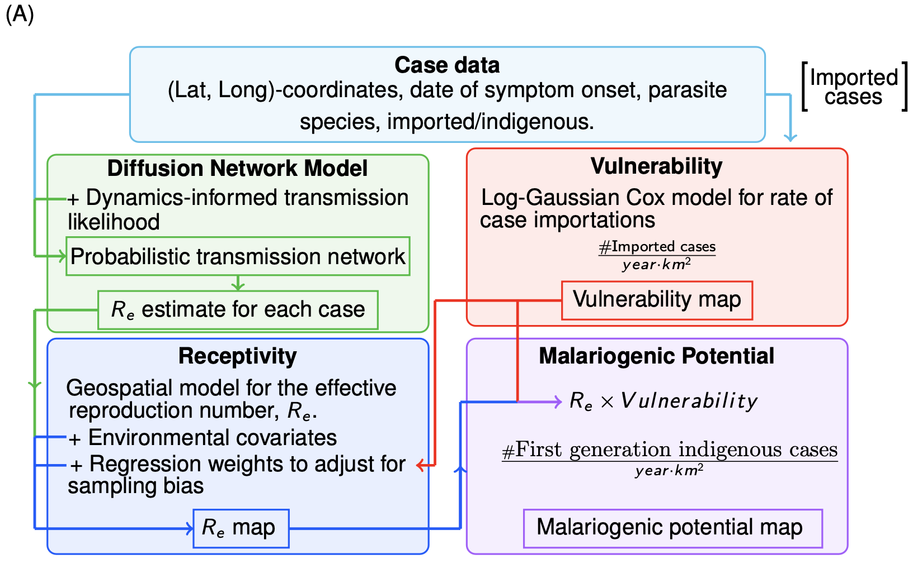

# Metrics Near Elimination


## Getting started
Here I provide only the code base. The installation of the necessary dependencies is left to the user and is not covered here.

There are three models: the diffusion network model, the log-Gaussian-Cox model for vulnerability, and the receptivity model. The diffusion network model is written in Python, and the remaining models are written in R. The schematic below illustrates the flow of data and model outputs through the pipeline. The file 'config.json' contains the input and output paths for a given model run. 

Note that for covariate extraction (steps 2 and 5), the paths in configuration_data/data_lookup.R must be updated to point to the correct data, and the lists of covariate names in the gather script must be set. There must be a file path associated with each covariate name in the gather scripts.

## Running the pipeline

1. Fit the diffusion netowrk model with default options (i.e. without computing the regression weights) by running the following command in the terminal:
``` 
python src/drivers/driver_diffusion_network.py --config=PATH_TO_CONFIG
```
where PATH_TO_CONFIG is replaced by the path to the configuration file (e.g. './config/config.json').

2. Attach covariates for the vulnerability model by running the following command:
``` 
Rscript src/drivers/driver_gather_vulnerability_covariates.R --config=PATH_TO_CONFIG
```

3. Fit (and predict) the vulnerability model twice. First using only the cases labeled imported, then second using both the imported cases and cases with no known source from the diffusion network model. The respective commands 
``` 
Rscript src/drivers/driver_LGCM.R --config=PATH_TO_CONFIG
```
and 
``` 
Rscript src/drivers/driver_LGCM.R --config=PATH_TO_CONFIG --all_index_cases=TRUE
```
4. Compute the regression weights by combining the diffusion network model outputs with the vulnerability model predictions by calling
```
python src/drivers/driver_diffusion_network.py --config=PATH_TO_CONFIG --get_weights
```

5. Attach covariates for the receptivity model by running the following command:
```
Rscript src/drivers/driver_gather_receptivity_covariates.R --config=PATH_TO_CONFIG
```

6. Fit (and predict) the receptivity model using the following command:
```
Rscript src/drivers/driver_geospatial_model_Re.R --config=PATH_TO_CONFIG
```


## Requirements
I generally used the latest package versions at the time of putting the code together. I've listed the versions below; however, there is nothing special about these versions, so long as the code runs. 
### For R 4.2.1
*raster*: 3.6.26,
*dplyr*: 1.1.4,
*rgdal*: 1.6.7,
*sp*: 2.1.2,
*sf*: 1.0.15,
*MASS*: 7.3.57,
*glmmTMB*: 1.1.9,
*spocc*: 1.2.2,
*rnaturalearth*:1.0.1, 
*terra*:  1.7.55,
*INLA*: 24.2.9,
*rgeos*: 0.6.4,
*fields*:15.2,
*optparse*: 1.7.5,
*jsonlite*: 1.8.8


### For Python 3.12.5
*numpy* 1.26.4,
*pandas* 2.2.2,
*haversine* 2.8.1,
*tensorflow*: 2.16.2, 
*tensorflow_probability*: 0.24.0,
*rasterio* 1.4.1,
*tqdm*  4.66.6,
*matplotlib* 3.9.2,
*networkx* 3.3,
*json*: 2.0.9


***
## Schematic

 


## License
This project is licensed under the MIT License - see below for details:

MIT License

Copyright (c) [2024] [Michael McPhail/The Malaria Atlas Project]

Permission is hereby granted, free of charge, to any person obtaining a copy
of this software and associated documentation files (the "Software"), to deal
in the Software without restriction, including without limitation the rights
to use, copy, modify, merge, publish, distribute, sublicense, and/or sell
copies of the Software, and to permit persons to whom the Software is
furnished to do so, subject to the following conditions:

The above copyright notice and this permission notice shall be included in all
copies or substantial portions of the Software.

THE SOFTWARE IS PROVIDED "AS IS", WITHOUT WARRANTY OF ANY KIND, EXPRESS OR
IMPLIED, INCLUDING BUT NOT LIMITED TO THE WARRANTIES OF MERCHANTABILITY,
FITNESS FOR A PARTICULAR PURPOSE AND NONINFRINGEMENT. IN NO EVENT SHALL THE
AUTHORS OR COPYRIGHT HOLDERS BE LIABLE FOR ANY CLAIM, DAMAGES OR OTHER
LIABILITY, WHETHER IN AN ACTION OF CONTRACT, TORT OR OTHERWISE, ARISING FROM,
OUT OF OR IN CONNECTION WITH THE SOFTWARE OR THE USE OR OTHER DEALINGS IN THE
SOFTWARE.

